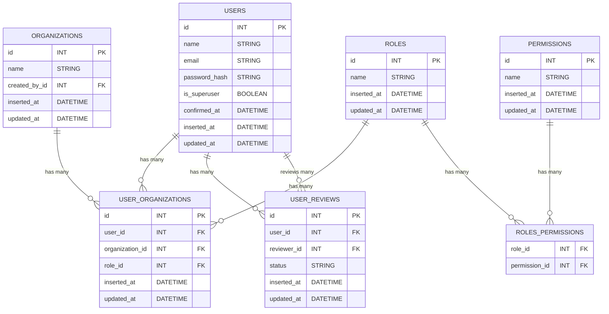

# OrgManagementSystem

To start your Phoenix server:

  * Run `mix setup` to install and setup dependencies
  * Start Phoenix endpoint with `mix phx.server` or inside IEx with `iex -S mix phx.server`

Now you can visit [`localhost:4000`](http://localhost:4000) from your browser.

Ready to run in production? Please [check our deployment guides](https://hexdocs.pm/phoenix/deployment.html).

## Learn more

  * Official website: https://www.phoenixframework.org/
  * Guides: https://hexdocs.pm/phoenix/overview.html
  * Docs: https://hexdocs.pm/phoenix
  * Forum: https://elixirforum.com/c/phoenix-forum
  * Source: https://github.com/phoenixframework/phoenix

## Design Documentation

### Thought Process

The OrgManagementSystem was designed to provide a robust and flexible way to manage users, organizations, roles, and permissions. The core requirements were:
- Support for multiple organizations, each with its own users and roles.
- Fine-grained role and permission management, allowing for custom access control.
- User review and approval workflows.

#### Key Design Decisions
- **Separation of Concerns:** Users, organizations, roles, and permissions are modeled as separate entities, allowing for scalability and maintainability.
- **Many-to-Many Relationships:** Users can belong to multiple organizations with different roles, implemented via a join table (`user_organizations`).
- **Role-Based Access Control (RBAC):** Roles are linked to permissions through a join table (`roles_permissions`), enabling flexible assignment of capabilities.
- **User Reviews:** The `user_reviews` table allows tracking of user status and review/approval processes.

### Entity-Relationship Diagram (ERD)

